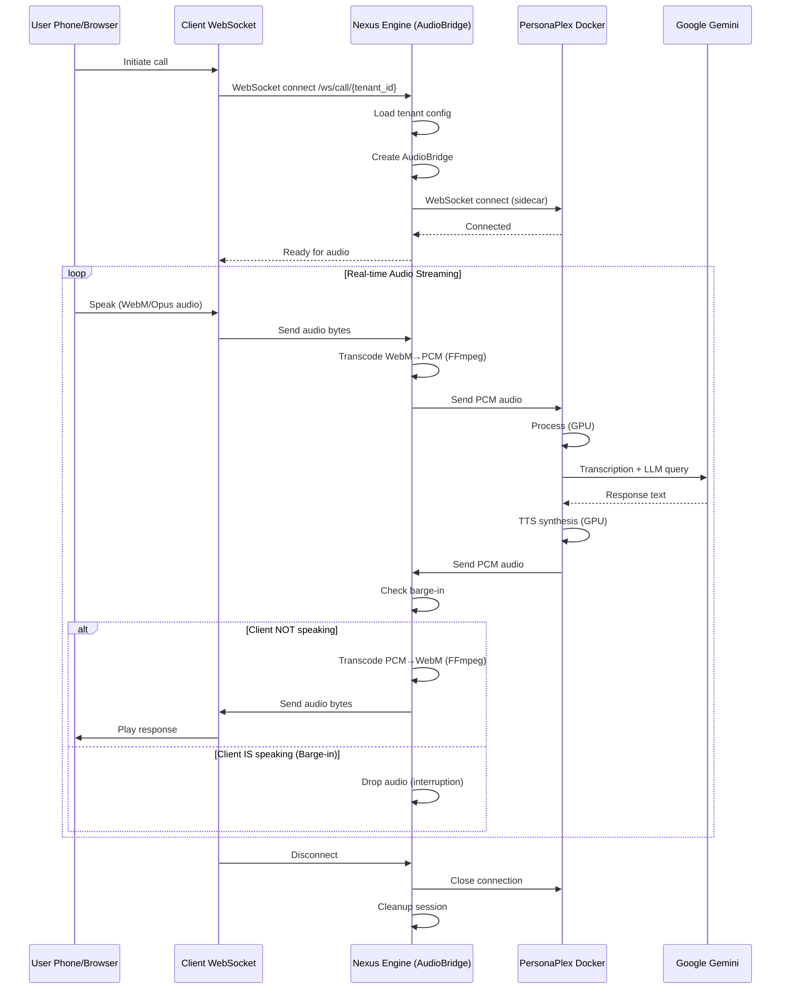
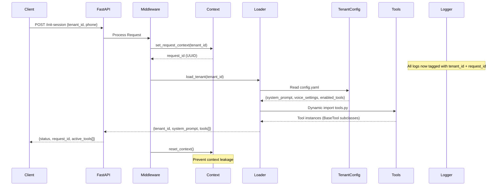
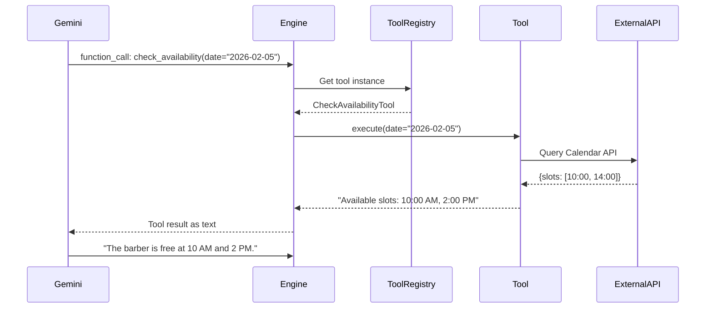

# PROJECT CONTEXT: Nexus Voice Engine

**Last Updated:** February 2026  
**Architecture Tier:** Tier 2 - Business Logic Feature (Modular Monolith with Sidecar)  
**Status:** Production Ready - Real-Time Audio Streaming

---

## 1. EXECUTIVE SUMMARY

Nexus Voice Engine is a **multi-tenant SaaS platform** that powers AI-driven voice agents with **real-time audio streaming**. It connects:
- **NVIDIA PersonaPlex** (External Docker Sidecar) for GPU-accelerated audio processing
- **Google Gemini** for high-intelligence conversational logic
- **Tenant-specific tools** for business operations (bookings, CRM, inventory, etc.)

**Core Philosophy:** Config-driven, tenant-isolated, SSOT-compliant architecture with sidecar pattern for audio processing.

**Key Architecture Decision:** PersonaPlex runs as an **external Docker container** (sidecar microservice). Nexus acts as a WebSocket proxy/bridge, handling audio transcoding, barge-in detection, and connection management.

---

## 2. ARCHITECTURE OVERVIEW

### 2.1 High-Level System Design (Sidecar Pattern)

**CRITICAL:** Nexus Voice Engine uses a **Sidecar Microservice Pattern** for audio processing.

```
┌──────────────────────────────────────────────────────────────────────┐
│                        NEXUS VOICE ENGINE                            │
│                    (FastAPI Orchestrator + Bridge)                   │
├──────────────────────────────────────────────────────────────────────┤
│                                                                      │
│  ┌─────────────┐    ┌──────────────┐    ┌──────────────┐          │
│  │   FastAPI   │───▶│  Middleware  │───▶│   Context    │          │
│  │   Server    │    │  (Context)   │    │   Manager    │          │
│  └─────────────┘    └──────────────┘    └──────────────┘          │
│         │                                       │                   │
│         ▼                                       ▼                   │
│  ┌─────────────┐                      ┌──────────────┐            │
│  │  Tenant     │◀────────────────────▶│   Logging    │            │
│  │  Loader     │                      │   System     │            │
│  └─────────────┘                      └──────────────┘            │
│         │                                                          │
│         ▼                                                          │
│  ┌──────────────────────────────────────────────────────┐        │
│  │            AUDIO BRIDGE (Proxy/Transcoder)           │        │
│  │  ┌────────────┐  ┌─────────────┐  ┌──────────────┐ │        │
│  │  │ WebSocket  │  │  FFmpeg     │  │  WebSocket   │ │        │
│  │  │ from       │─▶│  Transcoder │─▶│  to          │ │        │
│  │  │ Client     │  │  (WebM→PCM) │  │  PersonaPlex │ │        │
│  │  └────────────┘  └─────────────┘  └──────────────┘ │        │
│  │                                                      │        │
│  │  ┌────────────┐  ┌─────────────┐  ┌──────────────┐ │        │
│  │  │ WebSocket  │◀─│  FFmpeg     │◀─│  WebSocket   │ │        │
│  │  │ to         │  │  Transcoder │  │  from        │ │        │
│  │  │ Client     │  │  (PCM→WebM) │  │  PersonaPlex │ │        │
│  │  └────────────┘  └─────────────┘  └──────────────┘ │        │
│  │  + Barge-in Detection                               │        │
│  │  + Buffer Management                                │        │
│  └──────────────────────────────────────────────────────┘        │
│         │                                                          │
│         ▼                                                          │
│  ┌──────────────────────────────────────────────────────┐        │
│  │         TENANT ISOLATION LAYER                       │        │
│  │  ┌──────────┐  ┌──────────┐  ┌──────────┐          │        │
│  │  │ Tenant A │  │ Tenant B │  │ Tenant C │          │        │
│  │  │ Config   │  │ Config   │  │ Config   │ ...      │        │
│  │  │ + Tools  │  │ + Tools  │  │ + Tools  │          │        │
│  │  └──────────┘  └──────────┘  └──────────┘          │        │
│  └──────────────────────────────────────────────────────┘        │
│                                                                   │
└───────────────────────────────────────────────────────────────────┘
         │                                     │
         ▼                                     ▼
   ┌──────────┐                    ┌─────────────────────────┐
   │  Gemini  │                    │ NVIDIA PersonaPlex      │
   │   API    │                    │ (External Docker)       │
   │          │                    │ ws://localhost:9000     │
   └──────────┘                    │ • GPU-accelerated       │
                                   │ • WebSocket streaming   │
                                   │ • Sidecar pattern       │
                                   └─────────────────────────┘
```

### 2.2 Sidecar Pattern Explained

**Why Sidecar?**
1. **Resource Isolation:** PersonaPlex requires significant GPU resources (multiple GB of VRAM)
2. **Independent Scaling:** Scale audio processing independently from orchestration logic
3. **Development Flexibility:** Can mock PersonaPlex for testing without GPU
4. **Deployment Independence:** Update PersonaPlex without redeploying Nexus
5. **Technology Separation:** GPU-heavy C++/CUDA code separate from Python orchestration

**Communication Flow:**
1. **User Phone/Browser** → WebSocket → **Nexus Engine** (This app)
2. **Nexus Engine** → Audio Transcoding (FFmpeg) → WebSocket → **PersonaPlex Docker**
3. **PersonaPlex Docker** → PCM Audio → WebSocket → **Nexus Engine**
4. **Nexus Engine** → Audio Transcoding (FFmpeg) → WebSocket → **User Phone/Browser**

**Key Benefits:**
- ✅ Independent deployment (PersonaPlex updates don't affect Nexus)
- ✅ Resource isolation (GPU usage separate from Python process)
- ✅ Horizontal scaling (can run multiple PersonaPlex instances)
- ✅ Development flexibility (mock PersonaPlex for testing)

### 2.3 Core Components

| Component | Location | Responsibility | Coupling |
|-----------|----------|---------------|----------|
| **FastAPI Server** | `src/main.py` | HTTP/WebSocket endpoints, lifecycle management | Core |
| **AudioBridge** | `src/core/audio/streamer.py` | **Dual WebSocket proxy, audio transcoding, barge-in** | Core |
| **Context Manager** | `src/core/context.py` | Thread-safe request/tenant tracking | Core |
| **Logging System** | `config/logging_config.py` | Colored, context-aware structured logging | Core |
| **Tenant Loader** | `src/tenants/loader.py` | Dynamic config/tool loading | Core |
| **Conversation Manager** | `src/core/orchestration/conversation_manager.py` | LLM conversation and tool execution | Core |
| **Base Tool** | `src/interfaces/base_tool.py` | Abstract contract for all tools | Interface |
| **Tenant Configs** | `src/tenants/*/config.yaml` | Business-specific prompts, tools, voice settings | Tenant |
| **Tenant Tools** | `src/tenants/*/tools.py` | Executable Python functions for external integrations | Tenant |
| **PersonaPlex Sidecar** | External Docker | **GPU-accelerated audio processing (NOT in this codebase)** | External |

---

## 3. DATA FLOW: REQUEST LIFECYCLE

### 3.1 Real-Time Audio Call Flow (PRIMARY)



### 3.2 Session Initialization Flow (Legacy HTTP)



### 3.3 Tool Execution Flow



---

## 4. QUICK START GUIDE

**Goal:** Get Nexus Voice Engine running with real-time audio in 10 minutes.

### Prerequisites

- Python 3.11+
- Docker (for PersonaPlex sidecar)
- FFmpeg installed on system
- NVIDIA GPU (for PersonaPlex) OR use mock for testing

### Step 1: Start PersonaPlex Docker Container

#### Option A: Production (with GPU)

```bash
# Pull and run PersonaPlex
docker run -d \
  --name personaplex \
  --gpus all \
  -p 9000:9000 \
  nvidia/personaplex:latest
  
# Verify it's running
docker logs personaplex
```

#### Option B: Development (Mock Server)

```bash
# Create mock server for testing
cat > tests/mock_personaplex.py << 'EOF'
import asyncio
import websockets

async def echo_server(websocket, path):
    async for message in websocket:
        await asyncio.sleep(0.1)  # Simulate processing
        await websocket.send(message)  # Echo back

start_server = websockets.serve(echo_server, "localhost", 9000)
asyncio.get_event_loop().run_until_complete(start_server)
asyncio.get_event_loop().run_forever()
EOF

# Run the mock server
python tests/mock_personaplex.py
```

### Step 2: Configure Nexus

```bash
# Create .env file with minimum required settings
cat > .env << 'EOF'
# PersonaPlex sidecar
PERSONAPLEX_WS_URL=ws://localhost:9000/v1/audio-stream

# Audio Protocol (MUST match NVIDIA's config)
AUDIO_SAMPLE_RATE=16000
AUDIO_BIT_DEPTH=16
AUDIO_CHANNELS=1
AUDIO_CHUNK_SIZE=4096

# Connection settings
PERSONAPLEX_CONNECT_TIMEOUT=10
PERSONAPLEX_MAX_RECONNECT_ATTEMPTS=3

# Logging
LOG_LEVEL=INFO
LOG_FORMAT=COLOR

# Gemini (for LLM)
GEMINI_API_KEY=your_actual_key_here
GEMINI_MODEL=gemini-1.5-pro
EOF
```

### Step 3: Install Dependencies

```bash
# Create virtual environment
python -m venv env
source env/bin/activate  # On Windows: env\Scripts\activate

# Install dependencies
pip install -r requirements.txt

# Verify FFmpeg is installed
ffmpeg -version
```

### Step 4: Start Nexus

```bash
# Start the server
uvicorn src.main:app --host 0.0.0.0 --port 8000 --reload
```

You should see:
```
[16:30:00] [INFO] nexus.logging: Logging initialized: Level=INFO, Format=COLOR
INFO:     Uvicorn running on http://0.0.0.0:8000
INFO:     Application startup complete.
```

### Step 5: Test Real-Time Audio

Create `test_audio.html`:

```html
<!DOCTYPE html>
<html>
<head>
    <title>Nexus Voice Test</title>
</head>
<body>
    <h1>Nexus Voice Engine - Audio Test</h1>
    <button id="start">Start Call</button>
    <button id="stop" disabled>Stop Call</button>
    <div id="status">Not connected</div>
    <div id="log"></div>

    <script>
        let ws = null;
        let mediaRecorder = null;

        document.getElementById('start').onclick = async () => {
            ws = new WebSocket('ws://localhost:8000/ws/call/barber_shop_demo?customer_phone=+1234567890');
            
            ws.onopen = () => {
                document.getElementById('status').textContent = 'Connected!';
                document.getElementById('start').disabled = true;
                document.getElementById('stop').disabled = false;
                log('WebSocket connected');
            };

            ws.onmessage = async (event) => {
                if (typeof event.data === 'string') {
                    const msg = JSON.parse(event.data);
                    log(`Message: ${msg.type} - ${msg.message || ''}`);
                } else {
                    log(`Received ${event.data.byteLength} bytes of audio`);
                }
            };

            ws.onerror = (error) => log(`Error: ${error}`);
            ws.onclose = () => {
                document.getElementById('status').textContent = 'Disconnected';
                document.getElementById('start').disabled = false;
                document.getElementById('stop').disabled = true;
                log('WebSocket closed');
            };

            // Start microphone
            try {
                const stream = await navigator.mediaDevices.getUserMedia({ 
                    audio: { echoCancellation: true, noiseSuppression: true } 
                });

                mediaRecorder = new MediaRecorder(stream, {
                    mimeType: 'audio/webm;codecs=opus'
                });

                mediaRecorder.ondataavailable = (e) => {
                    if (e.data.size > 0 && ws.readyState === WebSocket.OPEN) {
                        ws.send(e.data);
                        log(`Sent ${e.data.size} bytes`);
                    }
                };

                mediaRecorder.start(100);  // Send audio every 100ms
                log('Microphone started');
            } catch (err) {
                log(`Microphone error: ${err.message}`);
            }
        };

        document.getElementById('stop').onclick = () => {
            if (mediaRecorder) {
                mediaRecorder.stop();
                mediaRecorder.stream.getTracks().forEach(track => track.stop());
            }
            if (ws) ws.close();
        };

        function log(message) {
            const logDiv = document.getElementById('log');
            const time = new Date().toLocaleTimeString();
            logDiv.innerHTML = `[${time}] ${message}<br>` + logDiv.innerHTML;
        }
    </script>
</body>
</html>
```

Open in browser:
```bash
# macOS/Linux: open test_audio.html
# Windows: start test_audio.html
```

### Step 6: Monitor Logs

You should see colored logs:
```
[16:30:15] [INFO] [T: barber_shop_demo] nexus.api: 📞 Call initiated
[16:30:15] [INFO] [T: barber_shop_demo] src.core.audio.streamer: AudioBridge initialized
[16:30:15] [INFO] [T: barber_shop_demo] src.core.audio.streamer: Connecting to PersonaPlex...
[16:30:16] [INFO] [T: barber_shop_demo] src.core.audio.streamer: Successfully connected
[16:30:16] [DEBUG] [T: barber_shop_demo] src.core.audio.streamer: Sent 4096 bytes to PersonaPlex
```

---

## 5. SIDECAR ARCHITECTURE DEEP DIVE

### 5.1 AudioBridge Implementation

**File:** `src/core/audio/streamer.py` (515 lines)

**Purpose:** Manages dual WebSocket connections and audio transcoding

**Key Features:**
- ✅ Concurrent bidirectional streaming
- ✅ Audio transcoding (WebM ↔ PCM via FFmpeg)
- ✅ Barge-in detection (interrupt handling)
- ✅ Automatic reconnection with retry logic
- ✅ Error handling and recovery
- ✅ Buffer management

**Core Methods:**
- `connect_model()`: Connect to PersonaPlex sidecar with retry logic
- `handle_client_to_model()`: Stream client→PersonaPlex with transcoding
- `handle_model_to_client()`: Stream PersonaPlex→client with barge-in detection
- `transcode_to_pcm()`: Convert client audio to PCM using FFmpeg subprocess
- `transcode_from_pcm()`: Convert PCM to client format using FFmpeg subprocess
- `process_stream()`: Main loop managing concurrent streams via asyncio.gather()

### 5.2 Audio Transcoding Pipeline

**Client to PersonaPlex:**
```bash
# Input: WebM/Opus from browser
# Output: Raw PCM for PersonaPlex
ffmpeg -f webm -codec:a libopus -i pipe:0 \
       -f s16le -ar 16000 -ac 1 pipe:1
```

**PersonaPlex to Client:**
```bash
# Input: Raw PCM from PersonaPlex
# Output: WebM/Opus for browser
ffmpeg -f s16le -ar 16000 -ac 1 -i pipe:0 \
       -f webm -codec:a libopus -b:a 24k pipe:1
```

**Supported Formats:**

| Format | Use Case | Codec |
|--------|----------|-------|
| `webm_opus` | Browser/WebRTC | Opus (compressed) |
| `wav` | Traditional telephony | PCM WAV |
| `pcm_16` | Direct PersonaPlex | Raw 16-bit PCM |

### 5.3 Barge-In Detection

**Problem:** When user interrupts the AI, we must stop playing AI audio immediately.

**Solution:**
```python
# In handle_model_to_client()
if self.is_client_speaking:
    logger.debug("Barge-in detected: Dropping model audio")
    continue  # Don't send AI audio to client
```

**Mechanism:**
1. Track `is_client_speaking` flag
2. When client sends audio, set flag to `True`
3. Model audio is dropped if client is speaking
4. Flag resets after short delay (0.1s)

### 5.4 Connection Management

**PersonaPlex Connection Retry Logic:**
- Max attempts: 3 (configurable via `PERSONAPLEX_MAX_RECONNECT_ATTEMPTS`)
- Retry delay: 2 seconds (configurable via `PERSONAPLEX_RECONNECT_DELAY`)
- Connection timeout: 10 seconds (configurable via `PERSONAPLEX_CONNECT_TIMEOUT`)

**Error Handling:**
```python
try:
    await audio_bridge.connect_model()
except ConnectionError:
    await websocket.send_json({
        "type": "error",
        "code": "personaplex_unavailable",
        "message": "Audio service temporarily unavailable"
    })
    await websocket.close(code=1011)
```

**Graceful Shutdown:**
1. Stop audio streaming tasks
2. Close PersonaPlex connection
3. Cleanup conversation session
4. Reset context
5. Close client WebSocket

### 5.5 WebSocket Endpoint

**Primary Endpoint:** `/ws/call/{tenant_id}`

```python
@app.websocket("/ws/call/{tenant_id}")
async def call_endpoint(websocket: WebSocket, tenant_id: str, customer_phone: Optional[str] = None):
    """
    Primary endpoint for real-time voice calls.
    Implements the complete audio streaming lifecycle.
    """
```

**Flow:**
1. Accept WebSocket connection
2. Load tenant configuration
3. Create conversation session (LLM)
4. Initialize AudioBridge
5. Connect to PersonaPlex sidecar
6. Start bidirectional streaming (concurrent tasks)
7. Handle disconnection and cleanup

### 5.6 Performance Characteristics

**Latency Breakdown:**

| Stage | Typical Latency | Notes |
|-------|----------------|-------|
| Client → Nexus | 20-50ms | Network + WebSocket |
| Transcoding (WebM→PCM) | 5-15ms | FFmpeg subprocess |
| Nexus → PersonaPlex | 1-5ms | Local network |
| PersonaPlex Processing | 100-300ms | GPU inference |
| PersonaPlex → Nexus | 1-5ms | Local network |
| Transcoding (PCM→WebM) | 5-15ms | FFmpeg subprocess |
| Nexus → Client | 20-50ms | Network + WebSocket |
| **Total** | **150-450ms** | End-to-end |

**Resource Usage:**

| Component | CPU | Memory | GPU |
|-----------|-----|--------|-----|
| Nexus Engine | 10-30% | ~200MB | 0% |
| FFmpeg Transcoding | 5-15% | ~50MB | 0% |
| PersonaPlex | 5-10% | ~2GB | 80-100% |

**Optimization Tips:**
1. **Reduce Chunk Size:** Smaller chunks = lower latency (but higher CPU)
2. **Pre-load FFmpeg:** Keep FFmpeg processes warm
3. **Use Local Docker:** PersonaPlex on same host reduces network latency
4. **Optimize Audio Settings:** Lower sample rate if quality acceptable
5. **Connection Pooling:** Reuse WebSocket connections

### 5.7 Docker Deployment

**Docker Compose Example:**

```yaml
version: '3.8'

services:
  personaplex:
    image: nvidia/personaplex:latest
    ports:
      - "9000:9000"
    deploy:
      resources:
        reservations:
          devices:
            - driver: nvidia
              count: 1
              capabilities: [gpu]
  
  nexus-engine:
    build: .
    ports:
      - "8000:8000"
    environment:
      - PERSONAPLEX_WS_URL=ws://personaplex:9000/v1/audio-stream
      - GEMINI_API_KEY=${GEMINI_API_KEY}
      - LOG_LEVEL=INFO
      - LOG_FORMAT=JSON
    depends_on:
      - personaplex
```

---

## 6. TENANT ISOLATION STRATEGY

### 6.1 Multi-Tenancy Design

**Isolation Level:** Application-level (Shared Database, Isolated Execution Context)

Each tenant is isolated through:

1. **Configuration Isolation**
   - Each tenant has a separate directory under `src/tenants/`
   - No tenant can access another tenant's config or tools
   - Dynamic loading prevents cross-tenant contamination

2. **Execution Context Isolation**
   - `contextvars` ensures tenant_id propagates through async call chains
   - Logs are automatically tagged with the tenant making the request
   - Request IDs enable full traceability

3. **Code Isolation**
   - Core engine is **tenant-agnostic**
   - No hardcoded business logic in `src/core/` or `src/main.py`
   - Tools are loaded dynamically per request

### 6.2 Tenant Directory Structure

```
src/tenants/
├── _template/              # Copy this to create new tenants
│   ├── config.yaml         # Tenant configuration blueprint
│   └── tools.py            # Tool implementation template
├── barber_shop_demo/
│   ├── config.yaml         # Barber shop specific config
│   └── tools.py            # CheckAvailabilityTool, BookAppointmentTool
├── pizza_shop/             # Example: Future tenant
│   ├── config.yaml
│   └── tools.py            # CheckInventoryTool, PlaceOrderTool
└── loader.py               # Dynamic tenant loader
```

---

## 7. LOGGING STRATEGY

### 7.1 Context-Aware Logging

Every log entry is automatically enriched with:
- **Timestamp** (HH:MM:SS format)
- **Log Level** (DEBUG, INFO, WARNING, ERROR, CRITICAL)
- **Tenant ID** (Cyan colored in terminal)
- **Request ID** (Dim colored UUID for tracing)
- **Logger Name** (Module path)
- **Message**

### 7.2 Log Format Examples

**COLOR Format (Local Development):**
```
[10:32:15] [INFO    ] [T: barber_shop_01] [R: 3f7a8b2c-...] nexus.api: Initializing session for +972501234567
[10:32:16] [DEBUG   ] [T: barber_shop_01] [R: 3f7a8b2c-...] nexus.loader: Configuration loaded for barber_shop_01
[10:32:16] [INFO    ] [T: barber_shop_01] [R: 3f7a8b2c-...] nexus.api: Tools active: ['check_availability', 'book_appointment']
```

**JSON Format (Production/Cloud):**
```json
{"time": "10:32:15", "level": "INFO", "tenant": "barber_shop_01", "req_id": "3f7a8b2c-...", "logger": "nexus.api", "msg": "Initializing session"}
```

### 7.3 Reading Logs by Tenant

To filter logs for a specific tenant during debugging:
```bash
# Local development
grep "T: barber_shop_01" logs.txt

# Production (if using structured logging)
jq 'select(.tenant=="barber_shop_01")' logs.json
```

### 7.4 Log Level Control

Configure via `.env`:
```bash
LOG_LEVEL=DEBUG     # Show all logs including debug traces
LOG_LEVEL=INFO      # Standard operational logging (default)
LOG_LEVEL=WARNING   # Only warnings and errors
LOG_LEVEL=ERROR     # Only errors
```

---

## 8. HOW TO ADD A NEW TENANT (STEP-BY-STEP)

### Step 1: Copy the Template

```bash
cp -r src/tenants/_template src/tenants/my_restaurant
```

### Step 2: Edit the Configuration

Edit `src/tenants/my_restaurant/config.yaml`:

```yaml
tenant_id: "my_restaurant_01"

voice_settings:
  provider: "nvidia_personaplex"
  voice_id: "en_us_female_friendly"
  language: "en-US"

system_prompt: |
  You are the virtual assistant for 'Maria's Italian Restaurant'.
  You can help customers:
  - Check table availability
  - Make reservations
  - Answer questions about the menu
  
  Be warm, professional, and efficient.
  Our specialty is wood-fired pizza and homemade pasta.

enabled_tools:
  - "check_table_availability"
  - "make_reservation"
```

### Step 3: Implement the Tools

Edit `src/tenants/my_restaurant/tools.py`:

```python
from typing import Dict, Any
from src.interfaces.base_tool import BaseTool

class CheckTableAvailabilityTool(BaseTool):
    @property
    def name(self) -> str:
        return "check_table_availability"
    
    @property
    def description(self) -> str:
        return "Checks if a table is available for a specific date, time, and party size"
    
    @property
    def parameters(self) -> Dict[str, Any]:
        return {
            "type": "object",
            "properties": {
                "date": {"type": "string", "description": "YYYY-MM-DD"},
                "time": {"type": "string", "description": "HH:MM (24h format)"},
                "party_size": {"type": "integer", "description": "Number of guests"}
            },
            "required": ["date", "time", "party_size"]
        }
    
    async def execute(self, **kwargs) -> Any:
        # TODO: Connect to your reservation system API
        date = kwargs.get("date")
        time = kwargs.get("time")
        party_size = kwargs.get("party_size")
        
        return f"Table for {party_size} is available on {date} at {time}."


class MakeReservationTool(BaseTool):
    @property
    def name(self) -> str:
        return "make_reservation"
    
    @property
    def description(self) -> str:
        return "Books a table reservation"
    
    @property
    def parameters(self) -> Dict[str, Any]:
        return {
            "type": "object",
            "properties": {
                "customer_name": {"type": "string"},
                "phone": {"type": "string"},
                "date": {"type": "string"},
                "time": {"type": "string"},
                "party_size": {"type": "integer"}
            },
            "required": ["customer_name", "phone", "date", "time", "party_size"]
        }
    
    async def execute(self, **kwargs) -> Any:
        # TODO: Insert into reservation database
        return f"Reservation confirmed for {kwargs['customer_name']} on {kwargs['date']} at {kwargs['time']}."
```

### Step 4: Test the Configuration

```bash
# Start the server (if not running)
uvicorn src.main:app --reload --port 8000

# Test WebSocket connection
# Open test_audio.html and change tenant_id to "my_restaurant_01"
```

**Expected Result:** Colored logs showing session initialization with your new tenant.

---

## 9. TOOL DEVELOPMENT GUIDE

### 9.1 The BaseTool Contract

All tools **must** implement the `BaseTool` abstract class. This is the SSOT (Single Source of Truth) for tool execution.

**Required Properties:**
1. `name` - The function name that Gemini will call
2. `description` - Instructions for the LLM on when/how to use this tool
3. `parameters` - JSON Schema defining expected arguments
4. `execute()` - Async method containing the actual business logic

### 9.2 Tool Best Practices

✅ **DO:**
- Use strict typing (`-> str`, `-> Dict`, etc.)
- Add docstrings explaining the tool's purpose
- Handle errors gracefully (try/except)
- Log important actions using `logging.getLogger(__name__)`
- Return human-readable strings (Gemini will read them)
- Make execute() async-compatible

❌ **DON'T:**
- Return binary data or complex objects
- Hardcode tenant-specific values (use config instead)
- Make synchronous blocking calls (use async)
- Access other tenants' data
- Import from `src.core` (tools are leaf nodes)

### 9.3 Example: External API Integration

```python
import logging
import aiohttp
from typing import Dict, Any
from src.interfaces.base_tool import BaseTool

logger = logging.getLogger(__name__)

class CheckWeatherTool(BaseTool):
    @property
    def name(self) -> str:
        return "check_weather"
    
    @property
    def description(self) -> str:
        return "Gets current weather for a city"
    
    @property
    def parameters(self) -> Dict[str, Any]:
        return {
            "type": "object",
            "properties": {
                "city": {"type": "string", "description": "City name"}
            },
            "required": ["city"]
        }
    
    async def execute(self, **kwargs) -> Any:
        city = kwargs.get("city")
        logger.info(f"Fetching weather for {city}")
        
        try:
            async with aiohttp.ClientSession() as session:
                async with session.get(f"https://api.weather.com/v1/{city}") as resp:
                    data = await resp.json()
                    return f"The weather in {city} is {data['temp']}°C, {data['condition']}."
        except Exception as e:
            logger.error(f"Weather API failed: {e}")
            return "I'm having trouble checking the weather right now."
```

---

## 10. ARCHITECTURAL CONSTRAINTS

### 10.1 What You CAN Do

✅ Add new tenants (unlimited)  
✅ Add new tools per tenant  
✅ Modify tenant configs  
✅ Add new API endpoints to `main.py`  
✅ Enhance logging/observability  
✅ Add middleware for auth/rate-limiting  

### 10.2 What You CANNOT Do (Without Justification)

❌ Add a database (use external APIs for now)  
❌ Add a message queue (keep it synchronous)  
❌ Split into microservices  
❌ Hardcode business logic in `src/core/`  
❌ Import tenant-specific modules into core  
❌ Duplicate prompts/mappings across files  

**Rationale:** This is a **Tier 2 - Business Logic Feature**. We follow the Modular Monolith pattern until scale demands distribution.

---

## 11. TESTING STRATEGY

### 11.1 Manual Testing

```bash
# Health check
curl http://localhost:8000/

# Initialize session (legacy)
curl -X POST http://localhost:8000/init-session \
  -H "Content-Type: application/json" \
  -d '{"tenant_id": "barber_shop_demo", "customer_phone": "+972501234567"}'

# Test real-time audio
# Use test_audio.html from Quick Start section
```

### 11.2 Unit Testing (Future)

```python
# tests/unit/test_loader.py
import pytest
from src.tenants.loader import TenantLoader

def test_load_valid_tenant():
    context = TenantLoader.load_tenant("barber_shop_demo")
    assert context["tenant_id"] == "barber_shop_demo"
    assert len(context["tools"]) == 2
    assert context["tools"][0].name == "check_availability"

def test_load_invalid_tenant():
    with pytest.raises(FileNotFoundError):
        TenantLoader.load_tenant("nonexistent_tenant")
```

---

## 12. DEPLOYMENT CONSIDERATIONS

### 12.1 Environment Variables

**Critical Variables:**
- `PERSONAPLEX_WS_URL` - WebSocket URL for PersonaPlex Docker
- `AUDIO_SAMPLE_RATE=16000` - Must match PersonaPlex config
- `GEMINI_API_KEY` - Required for LLM functionality
- `LOG_LEVEL=INFO` - Control verbosity
- `LOG_FORMAT=JSON` - Use JSON for cloud environments

### 12.2 Production Checklist

- [ ] Start PersonaPlex Docker with GPU support
- [ ] Create `.env` with all required variables
- [ ] Set `LOG_FORMAT=JSON` for structured logging
- [ ] Set `LOG_LEVEL=INFO` or `WARNING`
- [ ] Install FFmpeg on system
- [ ] Configure rate limiting middleware
- [ ] Set up monitoring/alerting (future)
- [ ] Enable HTTPS (reverse proxy)
- [ ] Test audio streaming end-to-end

### 12.3 Scaling Strategy (Future)

**Current State:** Single instance, in-memory session state  
**Scale Trigger:** >500 concurrent sessions  
**Scale Path:**
1. Horizontal scaling (multiple Nexus instances)
2. Load balancing across multiple PersonaPlex containers
3. Shared session store (Redis)
4. Async task queue (Celery/RQ) for long-running tools
5. Consider microservices ONLY if team size justifies it

---

## 13. TROUBLESHOOTING

### Problem: PersonaPlex Connection Failed

**Error in logs:** `ConnectionRefusedError` or `Connection timeout`

**Solutions:**
1. Check if Docker is running: `docker ps | grep personaplex`
2. Start container: `docker start personaplex`
3. Check logs: `docker logs personaplex`
4. Verify port is exposed: `docker port personaplex`
5. Check firewall rules
6. Verify `PERSONAPLEX_WS_URL` in `.env`

### Problem: Tenant not loading

**Check:**
```bash
ls src/tenants/your_tenant_id/
# Should see: config.yaml, tools.py
```

**Fix:**
- Ensure tenant directory matches the `tenant_id` exactly
- Verify `config.yaml` is valid YAML (use yamllint)

### Problem: Tool not executing

**Check logs for:**
```
[ERROR] nexus.loader: Tool 'my_tool' not found in enabled_tools
```

**Fix:**
- Add tool name to `enabled_tools` in `config.yaml`
- Ensure tool class inherits from `BaseTool`
- Verify the `name` property matches exactly

### Problem: No colored logs

**Check:**
```bash
pip list | grep colorlog
# Should show: colorlog 6.10.1
```

**Fix:**
```bash
pip install colorlog
```

### Problem: FFmpeg Not Found

**Error:** `FileNotFoundError: ffmpeg`

**Fix:**
```bash
# macOS
brew install ffmpeg

# Ubuntu/Debian
sudo apt-get install ffmpeg

# Windows
# Download from https://ffmpeg.org/download.html and add to PATH
```

### Problem: Audio Quality Issues

**Symptoms:** Distorted or choppy audio

**Solutions:**
1. Increase `AUDIO_CHUNK_SIZE` (reduces CPU load)
2. Check FFmpeg is installed: `ffmpeg -version`
3. Verify sample rate matches PersonaPlex config
4. Check network bandwidth
5. Enable audio debug logging: `AUDIO_DEBUG=true`

### Problem: Barge-In Not Working

**Symptoms:** AI continues speaking when user interrupts

**Solutions:**
1. Verify `is_client_speaking` logic in logs
2. Check client is sending audio continuously
3. Review timing in logs
4. Adjust barge-in sensitivity threshold

---

## 14. FUTURE ROADMAP

### Phase 1: Core Stability (COMPLETED ✅)
- ✅ Multi-tenant architecture
- ✅ Config-driven design
- ✅ Context-aware logging
- ✅ Dynamic tool loading
- ✅ Real-time audio streaming (Sidecar pattern)
- ✅ Barge-in detection
- ✅ Audio transcoding

### Phase 2: Production Readiness (IN PROGRESS)
- [ ] Authentication & API keys
- [ ] Rate limiting per tenant
- [ ] Comprehensive test coverage (pytest)
- [ ] CI/CD pipeline
- [ ] Monitoring/alerting (Prometheus/Grafana)
- [ ] Audio recording/playback
- [ ] Session persistence (Redis)

### Phase 3: Advanced Features
- [ ] Admin dashboard for tenant management
- [ ] Real-time analytics per tenant
- [ ] Tool marketplace
- [ ] Voice analytics (sentiment, intent)
- [ ] Multi-language support expansion
- [ ] Custom voice training per tenant

### Phase 4: Scale (If Needed)
- [ ] Redis for session state
- [ ] Message queue for async tools
- [ ] Multiple PersonaPlex instances with load balancing
- [ ] Kubernetes deployment
- [ ] Multi-region support
- [ ] Auto-scaling based on load

---

## 15. SECURITY CONSIDERATIONS

### 15.1 Current Security Measures

1. **No Direct Client Access:** Clients NEVER connect directly to PersonaPlex
2. **Tenant Isolation:** Each tenant's audio isolated via session management
3. **Input Validation:** Audio format and size validated
4. **Error Boundaries:** PersonaPlex failures don't crash Nexus
5. **Resource Limits:** Docker container limits PersonaPlex resources

### 15.2 Production Security Recommendations

- [ ] Add JWT authentication to `/ws/call` endpoint
- [ ] Implement rate limiting per tenant
- [ ] Add audio content filtering/validation
- [ ] Enable TLS/SSL for WebSocket (wss://)
- [ ] Monitor PersonaPlex health and auto-restart
- [ ] Log all audio metadata for compliance
- [ ] Implement CORS policies
- [ ] Add API key rotation
- [ ] Enable request signing

---

## 16. CONTRIBUTING GUIDELINES

### Before Making Changes

1. Read `docs/ARCHITECT_PROMPT.md` - Understand architectural principles
2. Read `docs/SYSTEM_EXECUTION_PROMPT.md` - Understand execution rules
3. Classify your change using the Complexity Gate (Tier 1/2/3)
4. **Update this document** if architecture changes

### Code Submission Checklist

- [ ] Change is config-driven (no hardcoded tenant logic)
- [ ] Follows SSOT principle (no duplication)
- [ ] Includes docstrings and type hints
- [ ] Logs important events with context
- [ ] Tested manually with audio streaming
- [ ] **Updated PROJECT_CONTEXT.md** if architecture changed
- [ ] No linter errors
- [ ] No new external documentation files created

---

## 17. GLOSSARY

| Term | Definition |
|------|------------|
| **Tenant** | A business client using the platform (e.g., barber shop, restaurant) |
| **Tool** | A Python function that executes business logic (e.g., book appointment) |
| **Context** | Request-scoped data (tenant_id, request_id) propagated through execution |
| **SSOT** | Single Source of Truth - one canonical definition of each concept |
| **Modular Monolith** | Single deployable unit with well-defined internal module boundaries |
| **Config-Driven** | Behavior defined in YAML, not hardcoded in Python |
| **Sidecar** | External microservice running alongside main application (PersonaPlex) |
| **AudioBridge** | Proxy component that connects client and PersonaPlex WebSockets |
| **Barge-in** | Interruption detection - stops AI audio when user speaks |
| **FFmpeg** | Audio transcoding tool for format conversion |
| **PCM** | Raw audio format (16-bit, 16kHz) used by PersonaPlex |

---

## 18. CONTACT & SUPPORT

**Project Maintainer:** Nexus AI Development Team  
**Architecture Questions:** Refer to `docs/ARCHITECT_PROMPT.md`  
**Execution Rules:** Refer to `docs/SYSTEM_EXECUTION_PROMPT.md`  
**Bug Reports:** [GitHub Issues]  
**Feature Requests:** Submit via architecture review process

---

**Document Version:** 2.0 (Sidecar Architecture)  
**Last Reviewed:** February 2026  
**Next Review:** March 2026  
**Status:** ✅ Production Ready with Real-Time Audio Streaming
