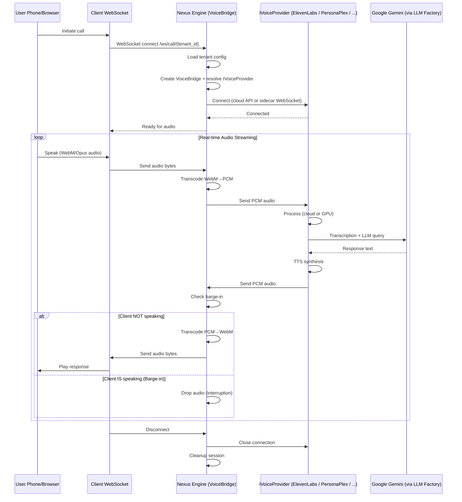
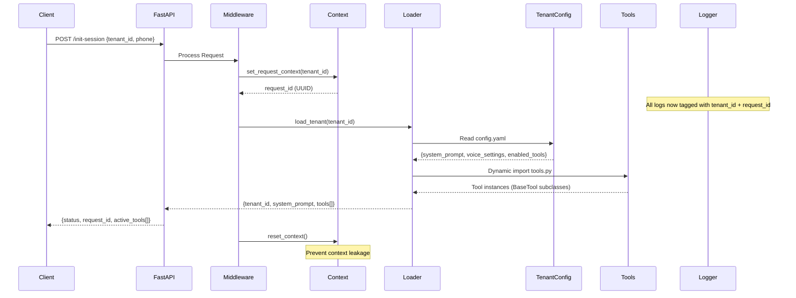
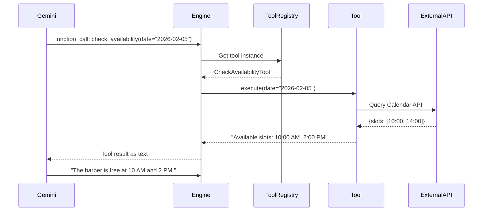
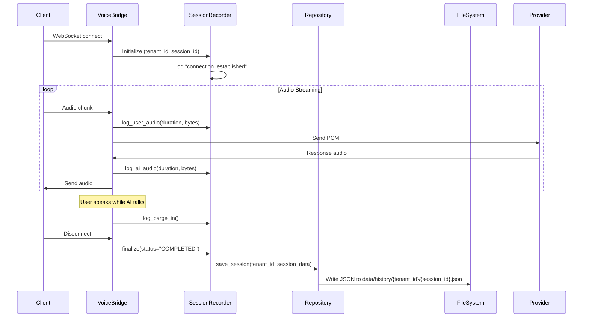
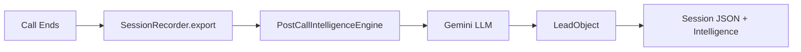

# PROJECT CONTEXT: Nexus Voice Engine

**Last Updated:** April 2026  
**Architecture Tier:** Tier 2 - Business Logic Feature (Modular Monolith with Pluggable Providers)  
**Status:** Production Ready - Real-Time Audio Streaming

---

## 1. EXECUTIVE SUMMARY

Nexus Voice Engine is a **multi-tenant SaaS platform** that powers AI-driven voice agents with **real-time audio streaming**. It connects:
- **Pluggable Voice Providers** (ElevenLabs cloud API, NVIDIA PersonaPlex Docker sidecar, etc.) via `IVoiceProvider` interface
- **Pluggable LLM Providers** (Google Gemini via factory pattern) for high-intelligence conversational logic
- **Tenant-specific tools** for business operations (bookings, CRM, inventory, etc.)

**Core Philosophy:** Config-driven, tenant-isolated, SSOT-compliant architecture with pluggable voice and LLM providers.

**Key Architecture Decision:** Voice processing is abstracted behind `IVoiceProvider`. Providers are selected per-tenant via config. PersonaPlex runs as an external Docker sidecar; ElevenLabs connects to a cloud API. Nexus acts as a WebSocket proxy/bridge via `VoiceBridge`, handling audio transcoding, barge-in detection, and connection management.

---

## 2. ARCHITECTURE OVERVIEW

### 2.1 High-Level System Design (Pluggable Voice Providers)

**CRITICAL:** Nexus Voice Engine uses a **VoiceBridge + IVoiceProvider** pattern for audio processing. Voice providers are pluggable: PersonaPlex uses a sidecar Docker container; ElevenLabs uses a cloud API.

```
┌──────────────────────────────────────────────────────────────────────┐
│                        NEXUS VOICE ENGINE                            │
│                    (FastAPI Orchestrator + Bridge)                   │
├──────────────────────────────────────────────────────────────────────┤
│                                                                      │
│  ┌─────────────┐    ┌──────────────┐    ┌──────────────┐          │
│  │   FastAPI   │───▶│  Middleware  │───▶│   Context    │          │
│  │   Server    │    │  (Context)   │    │   Manager    │          │
│  └─────────────┘    └──────────────┘    └──────────────┘          │
│         │                                       │                   │
│         ▼                                       ▼                   │
│  ┌─────────────┐                      ┌──────────────┐            │
│  │  Tenant     │◀────────────────────▶│   Logging    │            │
│  │  Loader     │                      │   System     │            │
│  └─────────────┘                      └──────────────┘            │
│         │                                                          │
│         ▼                                                          │
│  ┌──────────────────────────────────────────────────────┐        │
│  │        VOICE BRIDGE (Proxy + IVoiceProvider)         │        │
│  │  ┌────────────┐  ┌─────────────┐  ┌──────────────┐ │        │
│  │  │ WebSocket  │  │  Audio      │  │ IVoiceProvider│ │        │
│  │  │ from       │─▶│  Transcoder │─▶│  .send()     │ │        │
│  │  │ Client     │  │  (WebM→PCM) │  │              │ │        │
│  │  └────────────┘  └─────────────┘  └──────────────┘ │        │
│  │                                                      │        │
│  │  ┌────────────┐  ┌─────────────┐  ┌──────────────┐ │        │
│  │  │ WebSocket  │◀─│  Audio      │◀─│ IVoiceProvider│ │        │
│  │  │ to         │  │  Transcoder │  │  .recv()     │ │        │
│  │  │ Client     │  │  (PCM→WebM) │  │              │ │        │
│  │  └────────────┘  └─────────────┘  └──────────────┘ │        │
│  │  + Barge-in Detection                               │        │
│  │  + Buffer Management                                │        │
│  │  + Provider Factory (selects provider per tenant)   │        │
│  └──────────────────────────────────────────────────────┘        │
│         │                                                          │
│         ▼                                                          │
│  ┌──────────────────────────────────────────────────────┐        │
│  │         TENANT ISOLATION LAYER                       │        │
│  │  ┌──────────┐  ┌──────────┐  ┌──────────┐          │        │
│  │  │ Tenant A │  │ Tenant B │  │ Tenant C │          │        │
│  │  │ Config   │  │ Config   │  │ Config   │ ...      │        │
│  │  │ + Tools  │  │ + Tools  │  │ + Tools  │          │        │
│  │  └──────────┘  └──────────┘  └──────────┘          │        │
│  └──────────────────────────────────────────────────────┘        │
│                                                                   │
└───────────────────────────────────────────────────────────────────┘
         │                          │                    │
         ▼                          ▼                    ▼
   ┌──────────┐          ┌──────────────────┐  ┌──────────────────┐
   │  Gemini  │          │ ElevenLabs       │  │ PersonaPlex      │
   │   API    │          │ (Cloud API)      │  │ (Docker Sidecar) │
   │ (LLM)   │          │ • Cloud-hosted   │  │ ws://localhost:9000│
   └──────────┘          │ • REST/WebSocket │  │ • GPU-accelerated │
                         └──────────────────┘  │ • Sidecar pattern │
                                               └──────────────────┘
```

### 2.2 Voice Provider Architecture

**Provider Pattern:** Voice processing is abstracted behind `IVoiceProvider` (`src/core/voice/base_provider.py`). Providers are resolved per-tenant by `ProviderFactory` (`src/core/voice/provider_factory.py`).

**Available Providers:**
| Provider | Module | Transport | Notes |
|----------|--------|-----------|-------|
| **ElevenLabs** | `src/core/voice/elevenlabs_provider.py` | Cloud REST/WebSocket API | No local infrastructure required |
| **PersonaPlex** | `src/core/voice/personaplex_provider.py` | Local Docker sidecar (`ws://localhost:9000`) | Requires GPU, sidecar pattern (see below) |

**PersonaPlex Sidecar Pattern (provider-specific):**

The sidecar pattern applies specifically to the PersonaPlex provider, not the whole system. ElevenLabs is cloud-based and requires no sidecar.

*Why Sidecar for PersonaPlex?*
1. **Resource Isolation:** PersonaPlex requires significant GPU resources (multiple GB of VRAM)
2. **Independent Scaling:** Scale audio processing independently from orchestration logic
3. **Development Flexibility:** Can mock PersonaPlex for testing without GPU
4. **Deployment Independence:** Update PersonaPlex without redeploying Nexus
5. **Technology Separation:** GPU-heavy C++/CUDA code separate from Python orchestration

**Communication Flow (generic, applies to all providers):**
1. **User Phone/Browser** → WebSocket → **Nexus Engine** (VoiceBridge)
2. **VoiceBridge** → Audio Transcoding → **IVoiceProvider.send()**
3. **IVoiceProvider.recv()** → Audio → **VoiceBridge**
4. **VoiceBridge** → Audio Transcoding → WebSocket → **User Phone/Browser**

**Key Benefits:**
- ✅ Provider-agnostic orchestration (swap providers via tenant config)
- ✅ Independent deployment (provider updates don't affect Nexus core)
- ✅ Resource isolation (GPU usage separate from Python process, when applicable)
- ✅ Development flexibility (mock any provider for testing)

### 2.3 Core Components

| Component | Location | Responsibility | Coupling |
|-----------|----------|---------------|----------|
| **FastAPI Server** | `src/main.py` | HTTP/WebSocket endpoints, lifecycle management | Core |
| **VoiceBridge** | `src/core/voice/bridge.py` | **WebSocket proxy, audio transcoding, barge-in, provider dispatch** | Core |
| **IVoiceProvider** | `src/core/voice/base_provider.py` | Abstract interface for pluggable voice providers | Interface |
| **ProviderFactory** | `src/core/voice/provider_factory.py` | Resolves voice provider per tenant config | Core |
| **ElevenLabsProvider** | `src/core/voice/elevenlabs_provider.py` | Cloud-based voice provider (ElevenLabs API) | Integration |
| **PersonaPlexProvider** | `src/core/voice/personaplex_provider.py` | Sidecar voice provider (Docker WebSocket) | Integration |
| **Context Manager** | `src/core/context.py` | Thread-safe request/tenant tracking | Core |
| **Logging System** | `config/logging_config.py` | Colored, context-aware structured logging | Core |
| **Tenant Loader** | `src/tenants/loader.py` | Dynamic config/tool loading | Core |
| **Conversation Manager** | `src/core/orchestration/conversation_manager.py` | LLM conversation and tool execution | Core |
| **Base Tool** | `src/interfaces/base_tool.py` | Abstract contract for all tools | Interface |
| **Tenant Configs** | `src/tenants/*/config.yaml` | Business-specific prompts, tools, voice settings | Tenant |
| **Tenant Tools** | `src/tenants/*/tools.py` | Executable Python functions for external integrations | Tenant |
| **PersonaPlex Sidecar** | External Docker | **GPU-accelerated audio processing (NOT in this codebase, used by PersonaPlexProvider)** | External |
| **Integrations** | `src/integrations/` | External service integrations (Google Calendar, mocks, etc.) | Integration |
| **SessionRecorder** | `src/core/history.py` | In-memory buffer for capturing real-time conversation events | Core |
| **FileSessionRepository** | `src/core/history.py` | File-based session persistence implementation | Core |
| **ISessionRepository** | `src/interfaces/session_repository.py` | Abstract interface for session persistence | Interface |

---

## 3. DATA FLOW: REQUEST LIFECYCLE

### 3.1 Real-Time Audio Call Flow (PRIMARY)


```mermaid
sequenceDiagram
    participant User as User Phone/Browser
    participant Client as Client WebSocket
    participant Nexus as Nexus Engine (VoiceBridge)
    participant Provider as IVoiceProvider (ElevenLabs / PersonaPlex / ...)
    participant Gemini as Google Gemini (via LLM Factory)

    User->>Client: Initiate call
    Client->>Nexus: WebSocket connect /ws/call/{tenant_id}
    Nexus->>Nexus: Load tenant config
    Nexus->>Nexus: Create VoiceBridge + resolve IVoiceProvider
    Nexus->>Provider: Connect (cloud API or sidecar WebSocket)
    Provider-->>Nexus: Connected
    Nexus-->>Client: Ready for audio

    loop Real-time Audio Streaming
        User->>Client: Speak (WebM/Opus audio)
        Client->>Nexus: Send audio bytes
        Nexus->>Nexus: Transcode WebM→PCM
        Nexus->>Provider: Send PCM audio
        Provider->>Provider: Process (cloud or GPU)
        Provider->>Gemini: Transcription + LLM query
        Gemini-->>Provider: Response text
        Provider->>Provider: TTS synthesis
        Provider->>Nexus: Send PCM audio
        Nexus->>Nexus: Check barge-in
        alt Client NOT speaking
            Nexus->>Nexus: Transcode PCM→WebM
            Nexus->>Client: Send audio bytes
            Client->>User: Play response
        else Client IS speaking (Barge-in)
            Nexus->>Nexus: Drop audio (interruption)
        end
    end

    Client->>Nexus: Disconnect
    Nexus->>Provider: Close connection
    Nexus->>Nexus: Cleanup session
```

### 3.2 Session Initialization Flow (Legacy HTTP)


```mermaid
sequenceDiagram
    participant Client
    participant FastAPI
    participant Middleware
    participant Context
    participant Loader
    participant TenantConfig
    participant Tools
    participant Logger

    Client->>FastAPI: POST /init-session {tenant_id, phone}
    FastAPI->>Middleware: Process Request
    Middleware->>Context: set_request_context(tenant_id)
    Context-->>Middleware: request_id (UUID)
    
    Note over Logger: All logs now tagged with tenant_id + request_id
    
    Middleware->>Loader: load_tenant(tenant_id)
    Loader->>TenantConfig: Read config.yaml
    TenantConfig-->>Loader: {system_prompt, voice_settings, enabled_tools}
    
    Loader->>Tools: Dynamic import tools.py
    Tools-->>Loader: Tool instances (BaseTool subclasses)
    
    Loader-->>FastAPI: {tenant_id, system_prompt, tools[]}
    FastAPI-->>Client: {status, request_id, active_tools[]}
    
    Middleware->>Context: reset_context()
    Note over Context: Prevent context leakage
```

### 3.3 Tool Execution Flow


```mermaid
sequenceDiagram
    participant Gemini
    participant Engine
    participant ToolRegistry
    participant Tool
    participant ExternalAPI

    Gemini->>Engine: function_call: check_availability(date="2026-02-05")
    Engine->>ToolRegistry: Get tool instance
    ToolRegistry-->>Engine: CheckAvailabilityTool
    Engine->>Tool: execute(date="2026-02-05")
    
    Tool->>ExternalAPI: Query Calendar API
    ExternalAPI-->>Tool: {slots: [10:00, 14:00]}
    
    Tool-->>Engine: "Available slots: 10:00 AM, 2:00 PM"
    Engine-->>Gemini: Tool result as text
    Gemini->>Engine: "The barber is free at 10 AM and 2 PM."
```

### 3.4 Session Persistence Flow

**Architecture Pattern:** Repository Pattern for future-proof persistence


```mermaid
sequenceDiagram
    participant Client
    participant VoiceBridge
    participant SessionRecorder
    participant Repository
    participant FileSystem

    Client->>VoiceBridge: WebSocket connect
    VoiceBridge->>SessionRecorder: Initialize (tenant_id, session_id)
    SessionRecorder->>SessionRecorder: Log "connection_established"
    
    loop Audio Streaming
        Client->>VoiceBridge: Audio chunk
        VoiceBridge->>SessionRecorder: log_user_audio(duration, bytes)
        VoiceBridge->>Provider: Send PCM
        Provider->>VoiceBridge: Response audio
        VoiceBridge->>SessionRecorder: log_ai_audio(duration, bytes)
        VoiceBridge->>Client: Send audio
    end
    
    Note over VoiceBridge: User speaks while AI talks
    VoiceBridge->>SessionRecorder: log_barge_in()
    
    Client->>VoiceBridge: Disconnect
    VoiceBridge->>SessionRecorder: finalize(status="COMPLETED")
    SessionRecorder->>Repository: save_session(tenant_id, session_data)
    Repository->>FileSystem: Write JSON to data/history/{tenant_id}/{session_id}.json
```

---

## 4. DATA PERSISTENCE & SESSION HISTORY

### 4.1 Architecture: Repository Pattern

**Why Repository Pattern?**

The session persistence layer uses the **Repository Pattern** to decouple the application logic from the storage implementation. This allows:
- ✅ **Future Migration:** Switch from files to PostgreSQL/MongoDB by changing config only
- ✅ **Testability:** Easy to mock repository for unit tests
- ✅ **Tenant Isolation:** Data segregated by directory structure
- ✅ **SSOT Compliance:** Single interface for all persistence operations

**Key Components:**

| Component | Location | Purpose |
|-----------|----------|---------|
| `ISessionRepository` | `src/interfaces/session_repository.py` | Abstract interface (contract) |
| `FileSessionRepository` | `src/core/history.py` | File-based implementation |
| `SessionRecorder` | `src/core/history.py` | In-memory event buffer |
| `data/history/{tenant}/` | Filesystem | Tenant-isolated storage |

### 4.2 Session Recording Architecture

**SessionRecorder** acts as an in-memory buffer during an active call:

```python
# Lifecycle
recorder = SessionRecorder(tenant_id, session_id)
recorder.log_user_audio(duration_ms, bytes_sent)
recorder.log_ai_text("Hello! How can I help you?")
recorder.log_tool_usage("check_availability", {...}, "Available slots...")
recorder.log_barge_in()  # User interrupted
recorder.finalize(status="COMPLETED")
session_data = recorder.export()  # Returns complete session JSON
```

**Events Captured:**
- ✅ User audio chunks (duration + bytes)
- ✅ User transcribed text (from PersonaPlex STT)
- ✅ AI responses (text + audio)
- ✅ Tool executions (name, input, output, duration)
- ✅ Barge-in events (interruptions)
- ✅ Errors and system events
- ✅ Connection lifecycle

### 4.3 Session Data Schema

**File Location:** `data/history/{tenant_id}/{session_id}.json`

**Schema:**
```json
{
  "session_id": "3f7a8b2c-1d4e-4f5a-b6c7-d8e9f0a1b2c3",
  "meta": {
    "tenant_id": "barber_shop_demo",
    "start_time": "2026-02-01T14:30:00.000Z",
    "end_time": "2026-02-01T14:35:42.123Z",
    "duration_seconds": 342.12,
    "status": "COMPLETED"
  },
  "statistics": {
    "user_messages": 5,
    "ai_messages": 6,
    "tool_calls": 2,
    "errors": 0,
    "total_events": 47
  },
  "summary": {
    "intent": "Unknown (To be implemented by LLM)",
    "outcome": "Success"
  },
  "transcript": [
    {
      "timestamp": "2026-02-01T14:30:00.123Z",
      "role": "system",
      "type": "connection_established",
      "event": "connection_established"
    },
    {
      "timestamp": "2026-02-01T14:30:05.456Z",
      "role": "user",
      "type": "audio",
      "duration_ms": 2000,
      "bytes": 64000
    },
    {
      "timestamp": "2026-02-01T14:30:07.789Z",
      "role": "user",
      "type": "text",
      "content": "Is there an appointment available for tomorrow?",
      "confidence": 0.95
    },
    {
      "timestamp": "2026-02-01T14:30:08.012Z",
      "role": "ai",
      "type": "text",
      "content": "Let me check our availability for you.",
      "voice_id": "en_us_male_calm"
    },
    {
      "timestamp": "2026-02-01T14:30:08.345Z",
      "role": "tool",
      "type": "execution",
      "name": "check_availability",
      "input": {"date": "2026-02-02", "time": "10:00"},
      "output": "Available slots: 10:00 AM, 2:00 PM",
      "execution_time_ms": 245
    },
    {
      "timestamp": "2026-02-01T14:30:09.678Z",
      "role": "ai",
      "type": "text",
      "content": "Yes, we have availability at 10 AM and 2 PM tomorrow."
    },
    {
      "timestamp": "2026-02-01T14:30:15.901Z",
      "role": "system",
      "type": "barge_in",
      "message": "User interrupted AI response"
    },
    {
      "timestamp": "2026-02-01T14:35:42.123Z",
      "role": "system",
      "type": "session_ended",
      "event": "session_ended",
      "status": "COMPLETED",
      "duration_seconds": 342.12
    }
  ]
}
```

### 4.4 Integration Points

**AudioBridge Integration:**

The `AudioBridge` automatically records events as they occur:

```python
# In src/core/audio/streamer.py
if self.recorder:
    self.recorder.log_user_audio(duration_ms, bytes_sent)
    self.recorder.log_ai_audio(duration_ms, bytes_sent)
    self.recorder.log_barge_in()
```

**Main WebSocket Endpoint:**

The `/ws/call/{tenant_id}` endpoint manages the session lifecycle:

```python
# Initialize
session_recorder = SessionRecorder(tenant_id, session_id)
session_repository = FileSessionRepository()

# Pass to AudioBridge
audio_bridge = AudioBridge(..., session_recorder=session_recorder)

# Save on cleanup (finally block)
session_recorder.finalize(status="COMPLETED")
session_data = session_recorder.export()
await session_repository.save_session(tenant_id, session_data)
```

### 4.5 Repository Implementations

**Current: File-Based Storage**

```python
# src/core/history.py
class FileSessionRepository(ISessionRepository):
    """Stores sessions as JSON files in data/history/{tenant}/"""
    
    async def save_session(self, tenant_id, session_data):
        # Atomic write: temp file → rename
        # UTF-8, pretty-printed JSON
        # Returns: file path
```

**Directory Structure:**
```
data/
└── history/
    ├── barber_shop_demo/
    │   ├── 3f7a8b2c-....json
    │   ├── 4d8c9e1f-....json
    │   └── 5a9b2c3d-....json
    ├── pizza_shop_01/
    │   └── 6b1c4d5e-....json
    └── .gitignore  # Ignore *.json (customer data)
```

**Future: Database Storage (Example)**

```python
# Future implementation (not yet built)
class PostgresSessionRepository(ISessionRepository):
    async def save_session(self, tenant_id, session_data):
        # INSERT INTO sessions (tenant_id, session_id, data, ...)
        # VALUES (%s, %s, %s::jsonb, ...)
```

**Switching Storage Backend:**

```yaml
# tenant config.yaml (future)
persistence:
  provider: "postgresql"  # or "file", "mongodb", "s3"
  connection_string: "${DATABASE_URL}"
```

### 4.6 Querying Session History

**List Recent Sessions:**

```python
repository = FileSessionRepository()
sessions = await repository.list_sessions("barber_shop_demo", limit=50)

for session in sessions:
    print(f"{session['session_id']}: {session['meta']['status']}")
```

**Retrieve Specific Session:**

```python
session_data = await repository.get_session("barber_shop_demo", session_id)
print(f"Duration: {session_data['meta']['duration_seconds']}s")
print(f"Messages: {session_data['statistics']['user_messages']}")
```

**Future: Analytics Dashboard**

```python
# Future: Aggregate statistics
SELECT 
    tenant_id,
    COUNT(*) as total_calls,
    AVG(duration_seconds) as avg_duration,
    SUM(statistics->>'tool_calls') as total_tool_calls
FROM sessions
WHERE status = 'COMPLETED'
GROUP BY tenant_id;
```

### 4.7 Privacy & Compliance

**Data Protection:**
- ✅ Tenant-isolated storage prevents data leakage
- ✅ JSON files contain customer audio metadata (not actual audio bytes)
- ✅ `.gitignore` prevents committing customer data to version control
- ✅ File permissions should be restricted (chmod 600)

**GDPR Compliance (Future):**
- [ ] Add `customer_consent` field to session metadata
- [ ] Implement data deletion API: `DELETE /sessions/{session_id}`
- [ ] Add retention policy (auto-delete after N days)
- [ ] Implement data export API (right to access)

### 4.8 Error Handling

**Session Status Values:**
- `COMPLETED`: Normal session termination
- `DISCONNECTED`: Client disconnected unexpectedly
- `ERROR`: Server-side error occurred

**Finalization in Error Cases:**

```python
try:
    await audio_bridge.process_stream()
except ConnectionError as e:
    recorder.log_error("connection_error", str(e))
    recorder.finalize(status="ERROR")
finally:
    await repository.save_session(tenant_id, recorder.export())
```

---

## 5. QUICK START GUIDE

**Goal:** Get Nexus Voice Engine running with real-time audio in 10 minutes.

### Prerequisites

- Python 3.11+
- Docker (for PersonaPlex sidecar) OR use mock for testing
- FFmpeg installed on system
- NVIDIA GPU (for PersonaPlex in production)

---

### 🚀 Option A: Automated Startup (RECOMMENDED)

**One command to start everything:**

```bash
# Install dependencies (first time only)
pip install -r requirements.txt

# Start development environment
python scripts/start_dev.py
```

**What it does:**
- ✅ Runs pre-flight checks (FFmpeg, ports, .env)
- ✅ Auto-creates `.env` from example if missing
- ✅ Starts Mock PersonaPlex sidecar (port 9000)
- ✅ Starts Nexus Engine (port 8000 or auto-finds free port)
- ✅ Handles graceful shutdown (Ctrl+C kills both processes)
- ✅ Streams logs from both services

**Expected output:**
```
╔══════════════════════════════════════════════════════════════════╗
║           Nexus Voice Engine - Development Startup               ║
╚══════════════════════════════════════════════════════════════════╝

============================================================
                    PRE-FLIGHT CHECKS
============================================================

✅ [CHECK] Virtual Environment → Active
✅ [CHECK] FFmpeg → Found in PATH
✅ [CHECK] Environment File → .env file exists
✅ [CHECK] Port 9000 (Mock Sidecar) → Available
✅ [CHECK] Port 8000 (Nexus Engine) → Available
✅ [CHECK] Python Dependencies → All installed

✓  [SUCCESS] All pre-flight checks PASSED

============================================================
           STARTING DEVELOPMENT ENVIRONMENT
============================================================

ℹ  [INFO] Starting Mock PersonaPlex Sidecar...
✓  [SUCCESS] Mock PersonaPlex Sidecar started (PID: 12345)
ℹ  [INFO] Starting Nexus Voice Engine...
✓  [SUCCESS] Nexus Voice Engine started (PID: 12346)

============================================================
                    SERVICES RUNNING
============================================================
✓ Mock PersonaPlex: ws://localhost:9000/v1/audio-stream
✓ Nexus Engine: http://localhost:8000
✓ WebSocket Endpoint: ws://localhost:8000/ws/call/{tenant_id}

Press Ctrl+C to stop all services

============================================================
                         LOGS
============================================================
[MOCK] 🚀 Mock NVIDIA PersonaPlex Server Starting
[NEXUS] INFO:     Started server process [12346]
[NEXUS] INFO:     Waiting for application startup.
[NEXUS] INFO:     Application startup complete.
```

**To stop:** Press `Ctrl+C` once. Both services will shut down gracefully.

---

### 🔧 Option B: Manual Startup (Advanced Users)

### Step 1: Start PersonaPlex Docker Container

#### Production (with GPU)

```bash
# Pull and run PersonaPlex
docker run -d \
  --name personaplex \
  --gpus all \
  -p 9000:9000 \
  nvidia/personaplex:latest
  
# Verify it's running
docker logs personaplex
```

#### Development (Mock Server)

The automated startup script (`python scripts/start_dev.py`) handles this automatically.

**Manual mock server (if needed):**
```bash
python tests/mock_personaplex.py
```

**Note:** The mock server is included in the repository (`tests/mock_personaplex.py`). It provides a simple echo server that simulates PersonaPlex for development/testing.

### Step 2: Configure Nexus

```bash
# Create .env file with minimum required settings
cat > .env << 'EOF'
# PersonaPlex sidecar
PERSONAPLEX_WS_URL=ws://localhost:9000/v1/audio-stream

# Audio Protocol (MUST match NVIDIA's config)
AUDIO_SAMPLE_RATE=16000
AUDIO_BIT_DEPTH=16
AUDIO_CHANNELS=1
AUDIO_CHUNK_SIZE=4096

# Connection settings
PERSONAPLEX_CONNECT_TIMEOUT=10
PERSONAPLEX_MAX_RECONNECT_ATTEMPTS=3

# Logging
LOG_LEVEL=INFO
LOG_FORMAT=COLOR

# Gemini (for LLM)
GEMINI_API_KEY=your_actual_key_here
GEMINI_MODEL=gemini-1.5-pro
EOF
```

### Step 3: Install Dependencies

```bash
# Create virtual environment
python -m venv env
source env/bin/activate  # On Windows: env\Scripts\activate

# Install dependencies
pip install -r requirements.txt

# Verify FFmpeg is installed
ffmpeg -version
```

### Step 4: Start Nexus

```bash
# Start the server
uvicorn src.main:app --host 0.0.0.0 --port 8000 --reload
```

You should see:
```
[16:30:00] [INFO] nexus.logging: Logging initialized: Level=INFO, Format=COLOR
INFO:     Uvicorn running on http://0.0.0.0:8000
INFO:     Application startup complete.
```

### Step 5: Test Real-Time Audio

Create `test_audio.html`:

```html
<!DOCTYPE html>
<html>
<head>
    <title>Nexus Voice Test</title>
</head>
<body>
    <h1>Nexus Voice Engine - Audio Test</h1>
    <button id="start">Start Call</button>
    <button id="stop" disabled>Stop Call</button>
    <div id="status">Not connected</div>
    <div id="log"></div>

    <script>
        let ws = null;
        let mediaRecorder = null;

        document.getElementById('start').onclick = async () => {
            ws = new WebSocket('ws://localhost:8000/ws/call/barber_shop_demo?customer_phone=+1234567890');
            
            ws.onopen = () => {
                document.getElementById('status').textContent = 'Connected!';
                document.getElementById('start').disabled = true;
                document.getElementById('stop').disabled = false;
                log('WebSocket connected');
            };

            ws.onmessage = async (event) => {
                if (typeof event.data === 'string') {
                    const msg = JSON.parse(event.data);
                    log(`Message: ${msg.type} - ${msg.message || ''}`);
                } else {
                    log(`Received ${event.data.byteLength} bytes of audio`);
                }
            };

            ws.onerror = (error) => log(`Error: ${error}`);
            ws.onclose = () => {
                document.getElementById('status').textContent = 'Disconnected';
                document.getElementById('start').disabled = false;
                document.getElementById('stop').disabled = true;
                log('WebSocket closed');
            };

            // Start microphone
            try {
                const stream = await navigator.mediaDevices.getUserMedia({ 
                    audio: { echoCancellation: true, noiseSuppression: true } 
                });

                mediaRecorder = new MediaRecorder(stream, {
                    mimeType: 'audio/webm;codecs=opus'
                });

                mediaRecorder.ondataavailable = (e) => {
                    if (e.data.size > 0 && ws.readyState === WebSocket.OPEN) {
                        ws.send(e.data);
                        log(`Sent ${e.data.size} bytes`);
                    }
                };

                mediaRecorder.start(100);  // Send audio every 100ms
                log('Microphone started');
            } catch (err) {
                log(`Microphone error: ${err.message}`);
            }
        };

        document.getElementById('stop').onclick = () => {
            if (mediaRecorder) {
                mediaRecorder.stop();
                mediaRecorder.stream.getTracks().forEach(track => track.stop());
            }
            if (ws) ws.close();
        };

        function log(message) {
            const logDiv = document.getElementById('log');
            const time = new Date().toLocaleTimeString();
            logDiv.innerHTML = `[${time}] ${message}<br>` + logDiv.innerHTML;
        }
    </script>
</body>
</html>
```

Open in browser:
```bash
# macOS/Linux: open test_audio.html
# Windows: start test_audio.html
```

### Step 6: Monitor Logs

You should see colored logs:
```
[16:30:15] [INFO] [T: barber_shop_demo] nexus.api: 📞 Call initiated
[16:30:15] [INFO] [T: barber_shop_demo] src.core.audio.streamer: AudioBridge initialized
[16:30:15] [INFO] [T: barber_shop_demo] src.core.audio.streamer: Connecting to PersonaPlex...
[16:30:16] [INFO] [T: barber_shop_demo] src.core.audio.streamer: Successfully connected
[16:30:16] [DEBUG] [T: barber_shop_demo] src.core.audio.streamer: Sent 4096 bytes to PersonaPlex
```

---

## 5. SIDECAR ARCHITECTURE DEEP DIVE

### 5.1 AudioBridge Implementation

**File:** `src/core/audio/streamer.py` (515 lines)

**Purpose:** Manages dual WebSocket connections and audio transcoding

**Key Features:**
- ✅ Concurrent bidirectional streaming
- ✅ Audio transcoding (WebM ↔ PCM via FFmpeg)
- ✅ Barge-in detection (interrupt handling)
- ✅ Automatic reconnection with retry logic
- ✅ Error handling and recovery
- ✅ Buffer management

**Core Methods:**
- `connect_model()`: Connect to PersonaPlex sidecar with retry logic
- `handle_client_to_model()`: Stream client→PersonaPlex with transcoding
- `handle_model_to_client()`: Stream PersonaPlex→client with barge-in detection
- `transcode_to_pcm()`: Convert client audio to PCM using FFmpeg subprocess
- `transcode_from_pcm()`: Convert PCM to client format using FFmpeg subprocess
- `process_stream()`: Main loop managing concurrent streams via asyncio.gather()

### 5.2 Audio Transcoding Pipeline

**Client to PersonaPlex:**
```bash
# Input: WebM/Opus from browser
# Output: Raw PCM for PersonaPlex
ffmpeg -f webm -codec:a libopus -i pipe:0 \
       -f s16le -ar 16000 -ac 1 pipe:1
```

**PersonaPlex to Client:**
```bash
# Input: Raw PCM from PersonaPlex
# Output: WebM/Opus for browser
ffmpeg -f s16le -ar 16000 -ac 1 -i pipe:0 \
       -f webm -codec:a libopus -b:a 24k pipe:1
```

**Supported Formats:**

| Format | Use Case | Codec |
|--------|----------|-------|
| `webm_opus` | Browser/WebRTC | Opus (compressed) |
| `wav` | Traditional telephony | PCM WAV |
| `pcm_16` | Direct PersonaPlex | Raw 16-bit PCM |

### 5.3 Barge-In Detection

**Problem:** When user interrupts the AI, we must stop playing AI audio immediately.

**Solution:**
```python
# In handle_model_to_client()
if self.is_client_speaking:
    logger.debug("Barge-in detected: Dropping model audio")
    continue  # Don't send AI audio to client
```

**Mechanism:**
1. Track `is_client_speaking` flag
2. When client sends audio, set flag to `True`
3. Model audio is dropped if client is speaking
4. Flag resets after short delay (0.1s)

### 5.4 Connection Management

**PersonaPlex Connection Retry Logic:**
- Max attempts: 3 (configurable via `PERSONAPLEX_MAX_RECONNECT_ATTEMPTS`)
- Retry delay: 2 seconds (configurable via `PERSONAPLEX_RECONNECT_DELAY`)
- Connection timeout: 10 seconds (configurable via `PERSONAPLEX_CONNECT_TIMEOUT`)

**Error Handling:**
```python
try:
    await audio_bridge.connect_model()
except ConnectionError:
    await websocket.send_json({
        "type": "error",
        "code": "personaplex_unavailable",
        "message": "Audio service temporarily unavailable"
    })
    await websocket.close(code=1011)
```

**Graceful Shutdown:**
1. Stop audio streaming tasks
2. Close PersonaPlex connection
3. Cleanup conversation session
4. Reset context
5. Close client WebSocket

### 5.5 WebSocket Endpoint

**Primary Endpoint:** `/ws/call/{tenant_id}`

```python
@app.websocket("/ws/call/{tenant_id}")
async def call_endpoint(websocket: WebSocket, tenant_id: str, customer_phone: Optional[str] = None):
    """
    Primary endpoint for real-time voice calls.
    Implements the complete audio streaming lifecycle.
    """
```

**Flow:**
1. Accept WebSocket connection
2. Load tenant configuration
3. Create conversation session (LLM)
4. Initialize AudioBridge
5. Connect to PersonaPlex sidecar
6. Start bidirectional streaming (concurrent tasks)
7. Handle disconnection and cleanup

### 5.6 Performance Characteristics

**Latency Breakdown:**

| Stage | Typical Latency | Notes |
|-------|----------------|-------|
| Client → Nexus | 20-50ms | Network + WebSocket |
| Transcoding (WebM→PCM) | 5-15ms | FFmpeg subprocess |
| Nexus → PersonaPlex | 1-5ms | Local network |
| PersonaPlex Processing | 100-300ms | GPU inference |
| PersonaPlex → Nexus | 1-5ms | Local network |
| Transcoding (PCM→WebM) | 5-15ms | FFmpeg subprocess |
| Nexus → Client | 20-50ms | Network + WebSocket |
| **Total** | **150-450ms** | End-to-end |

**Resource Usage:**

| Component | CPU | Memory | GPU |
|-----------|-----|--------|-----|
| Nexus Engine | 10-30% | ~200MB | 0% |
| FFmpeg Transcoding | 5-15% | ~50MB | 0% |
| PersonaPlex | 5-10% | ~2GB | 80-100% |

**Optimization Tips:**
1. **Reduce Chunk Size:** Smaller chunks = lower latency (but higher CPU)
2. **Pre-load FFmpeg:** Keep FFmpeg processes warm
3. **Use Local Docker:** PersonaPlex on same host reduces network latency
4. **Optimize Audio Settings:** Lower sample rate if quality acceptable
5. **Connection Pooling:** Reuse WebSocket connections

### 5.7 Docker Deployment

**Docker Compose Example:**

```yaml
version: '3.8'

services:
  personaplex:
    image: nvidia/personaplex:latest
    ports:
      - "9000:9000"
    deploy:
      resources:
        reservations:
          devices:
            - driver: nvidia
              count: 1
              capabilities: [gpu]
  
  nexus-engine:
    build: .
    ports:
      - "8000:8000"
    environment:
      - PERSONAPLEX_WS_URL=ws://personaplex:9000/v1/audio-stream
      - GEMINI_API_KEY=${GEMINI_API_KEY}
      - LOG_LEVEL=INFO
      - LOG_FORMAT=JSON
    depends_on:
      - personaplex
```

---

## 6. REVENUE INTELLIGENCE LAYER

### 6.1 Architecture Overview

The Revenue Intelligence Layer transforms raw conversation data into actionable business intelligence. It consists of three components:


```mermaid
flowchart LR
    A[Call Ends] --> B[SessionRecorder.export]
    B --> C[PostCallIntelligenceEngine]
    C --> D[Gemini LLM]
    D --> E[LeadObject]
    E --> F[Session JSON + Intelligence]
```

### 6.2 Post-Call Intelligence Engine

**File:** `src/core/intelligence.py`

**Purpose:** Analyzes completed session transcripts via LLM to extract structured lead data.

**Key Components:**
- `LeadObject` (Pydantic model) — customer name, phone, intent, sentiment, outcome, key topics, follow-up flag, summary
- `PostCallIntelligenceEngine` — extracts text transcript, sends to Gemini, parses response into a LeadObject

**Integration Point:** Called non-blocking in `main.py` `call_endpoint` finally block after session save.

**Robustness:**
- JSON parser strips markdown fences (```json) from LLM output
- Wrapped in try/except — failures never crash the call flow
- Returns a fallback LeadObject with error summary on any failure

**Output Schema:**
```json
{
  "intelligence": {
    "customer_name": "דני",
    "customer_phone": "+972501234567",
    "core_intent": "booking",
    "sentiment": "positive",
    "call_outcome": "booking_made",
    "key_topics": ["haircut", "availability", "pricing"],
    "follow_up_required": false,
    "summary": "Customer booked a haircut for tomorrow at 10am"
  }
}
```

### 6.3 Hybrid Context Configuration

Tenant configs now separate **identity/behavior** from **static knowledge**:

```yaml
# WHO the agent is (system_prompt)
system_prompt: |
  אתה העוזר האישי של 'מספרת יוסי'...

# WHAT the agent knows (knowledge_base)
knowledge_base:
  prices:
    - service: "תספורת גבר"
      price: "60 ש''ח"
  business_hours:
    sunday_thursday: "09:00-20:00"
  policies:
    - "ביטול תור עד 2 שעות לפני"
```

**How it works:**
- `TenantLoader.load_tenant()` detects the `knowledge_base` key
- If present, the recursive `_format_knowledge()` formatter converts it to human-readable text
- The formatted knowledge is appended to `system_prompt` under a "Business Information" header
- If absent, loader behaves identically to the legacy format (backward compatible)

### 6.4 Simulation Client

**File:** `scripts/simulate_customer.py`

**Purpose:** End-to-end test client that verifies the full pipeline.

**Phases:**
1. Hybrid config verification (TenantLoader)
2. Server health check
3. Multi-turn conversation via HTTP API
4. Session persistence validation
5. Intelligence engine direct test (with synthetic transcript)

**Usage:**
```bash
python scripts/simulate_customer.py --tenant barber_shop_demo
python scripts/simulate_customer.py --skip-server  # config + intelligence only
```

---

## 7. TENANT ISOLATION STRATEGY

### 7.1 Multi-Tenancy Design

**Isolation Level:** Application-level (Shared Database, Isolated Execution Context)

Each tenant is isolated through:

1. **Configuration Isolation**
   - Each tenant has a separate directory under `src/tenants/`
   - No tenant can access another tenant's config or tools
   - Dynamic loading prevents cross-tenant contamination

2. **Execution Context Isolation**
   - `contextvars` ensures tenant_id propagates through async call chains
   - Logs are automatically tagged with the tenant making the request
   - Request IDs enable full traceability

3. **Code Isolation**
   - Core engine is **tenant-agnostic**
   - No hardcoded business logic in `src/core/` or `src/main.py`
   - Tools are loaded dynamically per request

### 7.2 Tenant Directory Structure

```
src/tenants/
├── _template/              # Copy this to create new tenants
│   ├── config.yaml         # Tenant configuration blueprint (hybrid)
│   └── tools.py            # Tool implementation template
├── barber_shop_demo/
│   ├── config.yaml         # Barber shop config (hybrid)
│   └── tools.py            # CheckAvailabilityTool, BookAppointmentTool
├── pizza_shop/             # Example: Future tenant
│   ├── config.yaml
│   └── tools.py            # CheckInventoryTool, PlaceOrderTool
└── loader.py               # Dynamic tenant loader + knowledge formatter
```

---

## 8. LOGGING STRATEGY


### 7.1 Context-Aware Logging

Every log entry is automatically enriched with:
- **Timestamp** (HH:MM:SS format)
- **Log Level** (DEBUG, INFO, WARNING, ERROR, CRITICAL)
- **Tenant ID** (Cyan colored in terminal)
- **Request ID** (Dim colored UUID for tracing)
- **Logger Name** (Module path)
- **Message**

### 7.2 Log Format Examples

**COLOR Format (Local Development):**
```
[10:32:15] [INFO    ] [T: barber_shop_01] [R: 3f7a8b2c-...] nexus.api: Initializing session for +972501234567
[10:32:16] [DEBUG   ] [T: barber_shop_01] [R: 3f7a8b2c-...] nexus.loader: Configuration loaded for barber_shop_01
[10:32:16] [INFO    ] [T: barber_shop_01] [R: 3f7a8b2c-...] nexus.api: Tools active: ['check_availability', 'book_appointment']
```

**JSON Format (Production/Cloud):**
```json
{"time": "10:32:15", "level": "INFO", "tenant": "barber_shop_01", "req_id": "3f7a8b2c-...", "logger": "nexus.api", "msg": "Initializing session"}
```

### 7.3 Reading Logs by Tenant

To filter logs for a specific tenant during debugging:
```bash
# Local development
grep "T: barber_shop_01" logs.txt

# Production (if using structured logging)
jq 'select(.tenant=="barber_shop_01")' logs.json
```

### 7.4 Log Level Control

Configure via `.env`:
```bash
LOG_LEVEL=DEBUG     # Show all logs including debug traces
LOG_LEVEL=INFO      # Standard operational logging (default)
LOG_LEVEL=WARNING   # Only warnings and errors
LOG_LEVEL=ERROR     # Only errors
```

---

## 9. HOW TO ADD A NEW TENANT (STEP-BY-STEP)

### Step 1: Copy the Template

```bash
cp -r src/tenants/_template src/tenants/my_restaurant
```

### Step 2: Edit the Configuration

Edit `src/tenants/my_restaurant/config.yaml`:

```yaml
tenant_id: "my_restaurant_01"

voice_settings:
  provider: "nvidia_personaplex"
  voice_id: "en_us_female_friendly"
  language: "en-US"

system_prompt: |
  You are the virtual assistant for 'Maria's Italian Restaurant'.
  Help customers check tables and make reservations.
  Be warm, professional, and efficient.

knowledge_base:
  menu_highlights:
    - "Wood-fired Margherita Pizza"
    - "Homemade Tagliatelle Bolognese"
  hours:
    monday_saturday: "12:00-22:00"
    sunday: "Closed"

enabled_tools:
  - "check_table_availability"
  - "make_reservation"
```

### Step 3: Implement the Tools

Edit `src/tenants/my_restaurant/tools.py`:

```python
from typing import Dict, Any
from src.interfaces.base_tool import BaseTool

class CheckTableAvailabilityTool(BaseTool):
    @property
    def name(self) -> str:
        return "check_table_availability"
    
    @property
    def description(self) -> str:
        return "Checks if a table is available for a specific date, time, and party size"
    
    @property
    def parameters(self) -> Dict[str, Any]:
        return {
            "type": "object",
            "properties": {
                "date": {"type": "string", "description": "YYYY-MM-DD"},
                "time": {"type": "string", "description": "HH:MM (24h format)"},
                "party_size": {"type": "integer", "description": "Number of guests"}
            },
            "required": ["date", "time", "party_size"]
        }
    
    async def execute(self, **kwargs) -> Any:
        # TODO: Connect to your reservation system API
        date = kwargs.get("date")
        time = kwargs.get("time")
        party_size = kwargs.get("party_size")
        
        return f"Table for {party_size} is available on {date} at {time}."


class MakeReservationTool(BaseTool):
    @property
    def name(self) -> str:
        return "make_reservation"
    
    @property
    def description(self) -> str:
        return "Books a table reservation"
    
    @property
    def parameters(self) -> Dict[str, Any]:
        return {
            "type": "object",
            "properties": {
                "customer_name": {"type": "string"},
                "phone": {"type": "string"},
                "date": {"type": "string"},
                "time": {"type": "string"},
                "party_size": {"type": "integer"}
            },
            "required": ["customer_name", "phone", "date", "time", "party_size"]
        }
    
    async def execute(self, **kwargs) -> Any:
        # TODO: Insert into reservation database
        return f"Reservation confirmed for {kwargs['customer_name']} on {kwargs['date']} at {kwargs['time']}."
```

### Step 4: Test the Configuration

```bash
# Start the server (if not running)
uvicorn src.main:app --reload --port 8000

# Test WebSocket connection
# Open test_audio.html and change tenant_id to "my_restaurant_01"
```

**Expected Result:** Colored logs showing session initialization with your new tenant.

---

## 10. TOOL DEVELOPMENT GUIDE


### 9.1 The BaseTool Contract

All tools **must** implement the `BaseTool` abstract class. This is the SSOT (Single Source of Truth) for tool execution.

**Required Properties:**
1. `name` - The function name that Gemini will call
2. `description` - Instructions for the LLM on when/how to use this tool
3. `parameters` - JSON Schema defining expected arguments
4. `execute()` - Async method containing the actual business logic

### 9.2 Tool Best Practices

✅ **DO:**
- Use strict typing (`-> str`, `-> Dict`, etc.)
- Add docstrings explaining the tool's purpose
- Handle errors gracefully (try/except)
- Log important actions using `logging.getLogger(__name__)`
- Return human-readable strings (Gemini will read them)
- Make execute() async-compatible

❌ **DON'T:**
- Return binary data or complex objects
- Hardcode tenant-specific values (use config instead)
- Make synchronous blocking calls (use async)
- Access other tenants' data
- Import from `src.core` (tools are leaf nodes)

### 9.3 Example: External API Integration

```python
import logging
import aiohttp
from typing import Dict, Any
from src.interfaces.base_tool import BaseTool

logger = logging.getLogger(__name__)

class CheckWeatherTool(BaseTool):
    @property
    def name(self) -> str:
        return "check_weather"
    
    @property
    def description(self) -> str:
        return "Gets current weather for a city"
    
    @property
    def parameters(self) -> Dict[str, Any]:
        return {
            "type": "object",
            "properties": {
                "city": {"type": "string", "description": "City name"}
            },
            "required": ["city"]
        }
    
    async def execute(self, **kwargs) -> Any:
        city = kwargs.get("city")
        logger.info(f"Fetching weather for {city}")
        
        try:
            async with aiohttp.ClientSession() as session:
                async with session.get(f"https://api.weather.com/v1/{city}") as resp:
                    data = await resp.json()
                    return f"The weather in {city} is {data['temp']}°C, {data['condition']}."
        except Exception as e:
            logger.error(f"Weather API failed: {e}")
            return "I'm having trouble checking the weather right now."
```

---

## 11. ARCHITECTURAL CONSTRAINTS


### 10.1 What You CAN Do

✅ Add new tenants (unlimited)  
✅ Add new tools per tenant  
✅ Modify tenant configs  
✅ Add new API endpoints to `main.py`  
✅ Enhance logging/observability  
✅ Add middleware for auth/rate-limiting  

### 10.2 What You CANNOT Do (Without Justification)

❌ Add a database (use external APIs for now)  
❌ Add a message queue (keep it synchronous)  
❌ Split into microservices  
❌ Hardcode business logic in `src/core/`  
❌ Import tenant-specific modules into core  
❌ Duplicate prompts/mappings across files  

**Rationale:** This is a **Tier 2 - Business Logic Feature**. We follow the Modular Monolith pattern until scale demands distribution.

---

## 12. TESTING STRATEGY


### 11.1 Manual Testing

```bash
# Health check
curl http://localhost:8000/

# Initialize session (legacy)
curl -X POST http://localhost:8000/init-session \
  -H "Content-Type: application/json" \
  -d '{"tenant_id": "barber_shop_demo", "customer_phone": "+972501234567"}'

# Test real-time audio
# Use test_audio.html from Quick Start section
```

### 11.2 Unit Testing (Future)

```python
# tests/unit/test_loader.py
import pytest
from src.tenants.loader import TenantLoader

def test_load_valid_tenant():
    context = TenantLoader.load_tenant("barber_shop_demo")
    assert context["tenant_id"] == "barber_shop_demo"
    assert len(context["tools"]) == 2
    assert context["tools"][0].name == "check_availability"

def test_load_invalid_tenant():
    with pytest.raises(FileNotFoundError):
        TenantLoader.load_tenant("nonexistent_tenant")
```

---

## 13. DEPLOYMENT CONSIDERATIONS


### 12.1 Environment Variables

**Critical Variables:**
- `PERSONAPLEX_WS_URL` - WebSocket URL for PersonaPlex Docker
- `AUDIO_SAMPLE_RATE=16000` - Must match PersonaPlex config
- `GEMINI_API_KEY` - Required for LLM functionality
- `LOG_LEVEL=INFO` - Control verbosity
- `LOG_FORMAT=JSON` - Use JSON for cloud environments

### 12.2 Production Checklist

- [ ] Start PersonaPlex Docker with GPU support
- [ ] Create `.env` with all required variables
- [ ] Set `LOG_FORMAT=JSON` for structured logging
- [ ] Set `LOG_LEVEL=INFO` or `WARNING`
- [ ] Install FFmpeg on system
- [ ] Configure rate limiting middleware
- [ ] Set up monitoring/alerting (future)
- [ ] Enable HTTPS (reverse proxy)
- [ ] Test audio streaming end-to-end

### 12.3 Scaling Strategy (Future)

**Current State:** Single instance, in-memory session state  
**Scale Trigger:** >500 concurrent sessions  
**Scale Path:**
1. Horizontal scaling (multiple Nexus instances)
2. Load balancing across multiple PersonaPlex containers
3. Shared session store (Redis)
4. Async task queue (Celery/RQ) for long-running tools
5. Consider microservices ONLY if team size justifies it

---

## 14. TROUBLESHOOTING


### Problem: PersonaPlex Connection Failed

**Error in logs:** `ConnectionRefusedError` or `Connection timeout`

**Solutions:**
1. Check if Docker is running: `docker ps | grep personaplex`
2. Start container: `docker start personaplex`
3. Check logs: `docker logs personaplex`
4. Verify port is exposed: `docker port personaplex`
5. Check firewall rules
6. Verify `PERSONAPLEX_WS_URL` in `.env`

### Problem: Tenant not loading

**Check:**
```bash
ls src/tenants/your_tenant_id/
# Should see: config.yaml, tools.py
```

**Fix:**
- Ensure tenant directory matches the `tenant_id` exactly
- Verify `config.yaml` is valid YAML (use yamllint)

### Problem: Tool not executing

**Check logs for:**
```
[ERROR] nexus.loader: Tool 'my_tool' not found in enabled_tools
```

**Fix:**
- Add tool name to `enabled_tools` in `config.yaml`
- Ensure tool class inherits from `BaseTool`
- Verify the `name` property matches exactly

### Problem: No colored logs

**Check:**
```bash
pip list | grep colorlog
# Should show: colorlog 6.10.1
```

**Fix:**
```bash
pip install colorlog
```

### Problem: FFmpeg Not Found

**Error:** `FileNotFoundError: ffmpeg`

**Fix:**
```bash
# macOS
brew install ffmpeg

# Ubuntu/Debian
sudo apt-get install ffmpeg

# Windows
# Download from https://ffmpeg.org/download.html and add to PATH
```

### Problem: Audio Quality Issues

**Symptoms:** Distorted or choppy audio

**Solutions:**
1. Increase `AUDIO_CHUNK_SIZE` (reduces CPU load)
2. Check FFmpeg is installed: `ffmpeg -version`
3. Verify sample rate matches PersonaPlex config
4. Check network bandwidth
5. Enable audio debug logging: `AUDIO_DEBUG=true`

### Problem: Barge-In Not Working

**Symptoms:** AI continues speaking when user interrupts

**Solutions:**
1. Verify `is_client_speaking` logic in logs
2. Check client is sending audio continuously
3. Review timing in logs
4. Adjust barge-in sensitivity threshold

---

## 15. FUTURE ROADMAP

### Phase 1: Core Stability (COMPLETED ✅)
- ✅ Multi-tenant architecture
- ✅ Config-driven design
- ✅ Context-aware logging
- ✅ Dynamic tool loading
- ✅ Real-time audio streaming (Sidecar pattern)
- ✅ Barge-in detection
- ✅ Audio transcoding
- ✅ **Session persistence (File-based with Repository Pattern)**

### Phase 1.5: Revenue Intelligence Layer (COMPLETED ✅)
- ✅ **Post-Call Intelligence Engine** (LLM-based lead extraction)
- ✅ **Hybrid Context Configuration** (system_prompt + knowledge_base)
- ✅ **End-to-End Simulation Client** (scripts/simulate_customer.py)
- ✅ **LeadObject schema** (Pydantic model for structured output)

### Phase 2: Production Readiness (IN PROGRESS)
- [ ] Authentication & API keys
- [ ] Rate limiting per tenant
- [ ] Comprehensive test coverage (pytest)
- [ ] CI/CD pipeline
- [ ] Monitoring/alerting (Prometheus/Grafana)
- [ ] Audio recording/playback (actual audio bytes, not just metadata)
- [ ] Database migration (PostgreSQL/MongoDB via Repository Pattern)

### Phase 3: Advanced Features
- [ ] Admin dashboard for tenant management
- [ ] Real-time analytics per tenant
- [ ] Tool marketplace
- [ ] Lead CRM integration
- [ ] Voice analytics (advanced sentiment, intent trends)
- [ ] Multi-language support expansion
- [ ] Custom voice training per tenant

### Phase 4: Scale (If Needed)
- [ ] Redis for session state
- [ ] Message queue for async tools
- [ ] Multiple PersonaPlex instances with load balancing
- [ ] Kubernetes deployment
- [ ] Multi-region support
- [ ] Auto-scaling based on load

---

## 16. SECURITY CONSIDERATIONS


### 15.1 Current Security Measures

1. **No Direct Client Access:** Clients NEVER connect directly to PersonaPlex
2. **Tenant Isolation:** Each tenant's audio isolated via session management
3. **Input Validation:** Audio format and size validated
4. **Error Boundaries:** PersonaPlex failures don't crash Nexus
5. **Resource Limits:** Docker container limits PersonaPlex resources

### 15.2 Production Security Recommendations

- [ ] Add JWT authentication to `/ws/call` endpoint
- [ ] Implement rate limiting per tenant
- [ ] Add audio content filtering/validation
- [ ] Enable TLS/SSL for WebSocket (wss://)
- [ ] Monitor PersonaPlex health and auto-restart
- [ ] Log all audio metadata for compliance
- [ ] Implement CORS policies
- [ ] Add API key rotation
- [ ] Enable request signing

---

## 17. CONTRIBUTING GUIDELINES

### Before Making Changes

1. Read `docs/ARCHITECT_PROMPT.md` - Understand architectural principles
2. Read `docs/SYSTEM_EXECUTION_PROMPT.md` - Understand execution rules
3. Classify your change using the Complexity Gate (Tier 1/2/3)
4. **Update this document** if architecture changes

### Code Submission Checklist

- [ ] Change is config-driven (no hardcoded tenant logic)
- [ ] Follows SSOT principle (no duplication)
- [ ] Includes docstrings and type hints
- [ ] Logs important events with context
- [ ] Tested manually with audio streaming
- [ ] **Updated PROJECT_CONTEXT.md** if architecture changed
- [ ] No linter errors
- [ ] No new external documentation files created

---

## 18. GLOSSARY

| Term | Definition |
|------|------------|
| **Tenant** | A business client using the platform (e.g., barber shop, restaurant) |
| **Tool** | A Python function that executes business logic (e.g., book appointment) |
| **Context** | Request-scoped data (tenant_id, request_id) propagated through execution |
| **SSOT** | Single Source of Truth - one canonical definition of each concept |
| **Modular Monolith** | Single deployable unit with well-defined internal module boundaries |
| **Config-Driven** | Behavior defined in YAML, not hardcoded in Python |
| **Sidecar** | External microservice running alongside main application (PersonaPlex) |
| **AudioBridge** | Proxy component that connects client and PersonaPlex WebSockets |
| **Barge-in** | Interruption detection - stops AI audio when user speaks |
| **FFmpeg** | Audio transcoding tool for format conversion |
| **PCM** | Raw audio format (16-bit, 16kHz) used by PersonaPlex |
| **SessionRecorder** | In-memory buffer that captures real-time conversation events |
| **Repository Pattern** | Design pattern that abstracts data persistence layer |
| **ISessionRepository** | Interface defining contract for session storage |
| **FileSessionRepository** | File-based implementation of session persistence |
| **PostCallIntelligenceEngine** | LLM-powered analyzer that extracts LeadObjects from transcripts |
| **LeadObject** | Structured data model representing extracted revenue intelligence |
| **Hybrid Context** | Config pattern separating identity (system_prompt) from knowledge (knowledge_base) |

---

## 19. CONTACT & SUPPORT


**Project Maintainer:** Nexus AI Development Team  
**Architecture Questions:** Refer to `docs/ARCHITECT_PROMPT.md`  
**Execution Rules:** Refer to `docs/SYSTEM_EXECUTION_PROMPT.md`  
**Bug Reports:** [GitHub Issues]  
**Feature Requests:** Submit via architecture review process

---

**Document Version:** 3.0 (Revenue Intelligence Layer)  
**Last Reviewed:** February 2026  
**Next Review:** March 2026  
**Status:** ✅ Production Ready with Real-Time Audio Streaming + Revenue Intelligence
